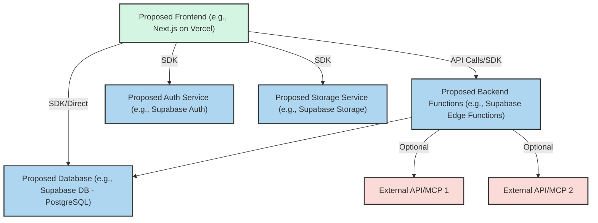

## 5. Design and Architecture (AI to Propose, User to Validate)
 
### 5.1. Design Philosophy and Principles (Agentic Design - User to Provide Preferences)
*User Instruction: The goal is an **exceptionally high-quality design and UX/UI, worthy of "Silicon Valley / Y Combinator" standards**. Please describe your general aesthetic preferences (e.g., "modern and clean look," "playful and colorful," "professional and sober"). If you have examples of sites/applications whose design you admire (especially those embodying this excellence), please share them. **'Vibe keywords'** (e.g., 'energetic and bold,' 'calm and focused,' 'futuristic and high-tech') are also very helpful. In the absence of preferences, the AI will propose a minimalist, modern style with careful typography, generous spacing, and an intentional color palette, aiming for this high quality.*
`[User to provide general aesthetic preferences, examples (ideally YC-style), or 'vibe keywords']`
 
*AI Instruction: Based on user input (and the YC-standard goal), or by initializing with the default style described, establish the Key Design Principles for THIS project. These principles must explicitly aim for UX/UI excellence and guide all your proposals.*
`[AI to Propose Specific Key Design Principles for User Validation, emphasizing the "Y Combinator standard" goal]`

### 5.2. Design System & UI Implementation Strategy (AI to Propose based on User Preferences & Defaults)
*AI Instruction: Based on user's aesthetic preferences (Section 5.1) and the default stack (Tailwind CSS, Shadcn/ui inspiration), propose the initial `[AI to Propose Project Name] Design System` tokens (primary/secondary colors, typography scale, core spacing units) for `tailwind.config.js`. Detail how Shadcn/ui components will be customized to fit this system. All visual design proposals are subject to human review.*
*   **Proposed Design System Name:** `[AI to Propose Project Name] Design System`
*   **Proposed Core Design Tokens (for `tailwind.config.js`):**
    *   Colors: `[AI to propose primary, secondary, accent, neutral palettes]`
    *   Typography: `[AI to propose font families, base sizes, scale]`
    *   Spacing: `[AI to propose base spacing unit and scale]`
*   **Shadcn/ui Customization Strategy:** *AI Instruction: When customizing Shadcn/ui components, your goal is to ensure they align seamlessly with the `[Project Name] Design System`'s tokens and interaction patterns. This means you will: 1. Override default styles using Tailwind utility classes mapped to our Design System tokens. 2. Adjust component structure or add/remove elements for our specific UX needs. 3. Ensure all interactive states (hover, focus, active, disabled) match our Design System's specifications. 4. The final component must feel unique to our brand, not like a generic Shadcn/ui component. Document these customizations in Storybook.*
*   **Storybook Plan:** `[AI to confirm Storybook will be used for all custom components]`
`[AI to Propose Design System and UI Strategy for User Validation]`

#### 5.2.1. Core UI Components List (AI to Propose Initial List)
*AI Instruction: Based on the features (Section 3.1) and user's design preferences (Section 5.1), propose an initial list of core, reusable UI components (e.g., PrimaryButton, SecondaryButton, Card, ModalShell, InputField, DataTable, NavigationBar). For each, briefly describe its purpose and key variants. This list will serve as a starting point for the `design_conventions.md` and Storybook development.*
`[AI to Propose Initial List of Core UI Components for User Validation]`

#### 5.2.2. Interaction Design Principles (AI to Propose Key Principles)
*AI Instruction: Propose 3-5 key principles for micro-interactions and animations that align with the "Silicon Valley / YC standard" of excellence and the user's desired 'vibe' (Section 5.1). Examples: "Feedback for all actions must be immediate and clear, using subtle visual cues.", "Transitions between states or views should be smooth, typically lasting 200-300ms, using ease-in-out timing.", "Animations should serve a purpose (guide attention, provide context) and not be purely decorative."*
`[AI to Propose Key Interaction Design Principles for User Validation]`

#### 5.2.3. Accessibility (A11Y) Specific Targets (AI to Propose)
*AI Instruction: Beyond the general WCAG 2.1 AA target (Section 4.6), are there specific accessibility aspects to emphasize for this project? (e.g., "Ensure all complex data visualizations are fully keyboard navigable and screen-reader friendly.", "Provide high-contrast themes as an option."). If no specific targets are identified by the user, reiterate the commitment to WCAG 2.1 AA and semantic HTML.*
`[AI to Propose Specific A11Y Targets or Reiterate General Commitment for User Validation]`

### 5.3. Proposed System Architecture (AI to Generate)
*AI Instruction: Generate a high-level system architecture diagram using **Mermaid syntax** showing the proposed/chosen frontend (e.g., Next.js), backend/database (e.g., Supabase: Auth, DB, Storage, Edge Functions), and any key proposed MCPs/Third-Party APIs. Briefly describe component responsibilities. Adapt the diagram if a different stack is chosen.*

`[AI to Refine Diagram and Description for User Validation]`

### 5.4. Technology Stack (User Override / Confirmation of Defaults)
*User Instruction: The project suggests Next.js, Supabase, and Tailwind CSS as a default stack (see Section 1.10). Use this section to specify your preferences for frontend framework, backend services (database, auth, storage, serverless functions), styling solutions, or any other tools, versions, or auxiliary libraries. If left blank, the AI will proceed with the suggested defaults and select appropriate versions/libraries, but will seek your confirmation.*
`[User to provide any overrides or specific requests]`

*AI Instruction: Confirm the final stack here after considering user input. You are responsible for selecting appropriate versions and necessary auxiliary libraries compatible with the core stack and project needs.*
`[AI to Confirm Final Stack (incorporating user input if any) for User Validation]`

### 5.5. Data Requirements (AI to Propose Model based on Features)
*User Instruction: You can list key data entities if you have them in mind (e.g., 'Users', 'Products', 'Orders'). Otherwise, the AI Agent will analyze the features you've described (Section 3.1) and propose a detailed database schema for the chosen database technology (e.g., Supabase/PostgreSQL). This proposal will be part of its detailed feature specification (Section 9.1.6) and will require your review.*
`[User to list key data entities, if known]`

*AI Instruction: Based on user's feature list and any listed entities, you will propose a detailed database schema (e.g., for Supabase/PostgreSQL using Prisma-like syntax or pseudo-SQL) in your feature specifications (Section 9.1.6). Also propose data seeding strategies for dev/test environments.*
`[This section is a directive to the AI; detailed proposals will be in AI's feature specs]`

### 5.6. Third-Party Integrations & MCP Servers (AI to Propose Solutions based on Needs)
*User Instruction: If you know you'll need specific types of integrations (e.g., 'payment processing via Stripe', 'email sending via Resend', 'maps functionality'), list them here at a high level. The AI Agent will research and propose specific services, MCP servers, or other APIs. The AI will detail its integration plan in its feature specifications (Section 9.1.9) for your review.*
`[User to list high-level integration needs]`

#### 5.6.1. Known and Desired MCP Catalog
*User Instruction: List here any MCPs you know exist and might want to use, or types of MCP functionality you desire. The AI will use this as input for its proposals.*
*   `[Example: stripe_payment_mcp: (Status: Known to User/Desired) For payment processing.]`
*   `[Example: content_moderation_mcp: (Status: Desired) For moderating user-generated content.]`
*   **Connected & Available MCPs (AI to verify and utilize first):**
    *   `context7`: (Status: Connected and Available) For library documentation lookup.
    *   `github`: (Status: Connected and Available) For GitHub repository operations.
    *   `puppeteer`: (Status: Connected and Available) For web automation/scraping.
    *   `stripe`: (Status: Connected and Available) For payment processing.
    *   `playwright`: (Status: Connected and Available) For advanced web automation and testing.
    *   `sequential-thinking`: (Status: Connected and Available) For complex problem solving and planning.
    *   `shadcn`: (Status: Connected and Available) For UI component registry interactions.
    *   `@21st-dev/magic`: (Status: Connected and Available) For UI component generation and refinement.
    *   `ElevenLabs`: (Status: Connected and Available) For AI-based audio generation.
    *   `convex`: (Status: Connected and Available) For Convex backend interactions.
    *   `mcp-server-firecrawl`: (Status: Connected and Available) For web scraping and crawling.
    *   `Roo Orchestrator/Code`: (Status: Integrated) For AI-assisted task management (see [`../../../02_AI-DOCS/TaskManagement/Roo_Task_Workflow.md`](../../../02_AI-DOCS/TaskManagement/Roo_Task_Workflow.md) for workflow and [`../../../02_AI-DOCS/TaskManagement/Tasks_JSON_Structure.md`](../../../02_AI-DOCS/TaskManagement/Tasks_JSON_Structure.md) for [`tasks.json`](../../../tasks/tasks.json) structure).
    *   `supabase` (MCP): (Status: Connected and Available) For direct Supabase project interactions.
    *   `memory`: (Status: Connected and Available) For knowledge graph interactions.
    *   `everything`: (Status: Connected and Available) For MCP testing and demos.
`[User to fill or leave for AI to populate based on needs identified from features]`
*AI Instruction: Review this catalog. For "Connected and Available" MCPs, prioritize their use. For "Known" or "Desired" MCPs not yet connected, or for new needs, follow protocol in 9.7.1. You can also propose additions to this catalog if new needs are identified.*

*AI Instruction: Based on user's feature list and any stated integration needs or catalog entries, you will research and propose specific third-party services, **MCP servers**, or other APIs. Detail your proposals, including rationale and integration points, in your feature specifications (Section 9.1.9). Prioritize robust, secure, and well-supported options compatible with the chosen technology stack (e.g., Next.js/Supabase, or alternatives). For all MCP integrations, you MUST implement them following the detailed logic outlined in Section 9.9 'Standard MCP Integration Logic'.*
`[This section is a directive to the AI; detailed proposals will be in AI's feature specs]`

### 5.7. Directory Structure and Naming Conventions (AI to Adhere to Defaults)
*AI Instruction: You will adhere to a conventional project structure (e.g., the default Agentic Project Boilerplate structure in Section 5.8 if Next.js is chosen, or an equivalent standard structure for the selected framework), which typically uses Atomic Design principles for frontend frameworks. Key conventions generally include `PascalCase.tsx` (or equivalent for other languages) for components/pages, `kebab-case.ts` (or equivalent) for utils, and `camelCase` for functions/variables. Clarify any deviations if necessary for specific project needs in your technical proposals.*
    *   **Suggested Structure Overview (e.g., for Next.js App Router & Atomic Design):**
        ```
        /app/(routes)
        /components/{atoms,molecules,organisms,templates,ui}
        /lib, /config, /styles, /public, /stories, /tests
        ```
`[This section confirms AI's adherence to predefined standards]`

### 5.8. Agentic Project Boilerplate (Conceptual - AI to Assume)
*AI Instruction: You will operate as if starting from or evolving an "Agentic Project Boilerplate." If Next.js is chosen, this pre-configured template includes: TypeScript (strict), Tailwind CSS (with base design tokens to be defined by you based on user input/defaults), Atomic Design structure, ESLint/Prettier/Husky, Storybook, basic testing setup, and CI/CD placeholders. If a different framework is selected, you will adapt to a similar standard boilerplate for that technology. Your initial project setup tasks should include structuring the project files and base configurations accordingly. If a Git repository with an actual boilerplate is provided by the user, you should use that as your starting point. Otherwise, create the foundational structure (directories, key config files, basic `package.json` or equivalent with chosen technologies) according to the conceptual boilerplate for the selected stack.*
`[This section sets AI's operational context]`

--- 